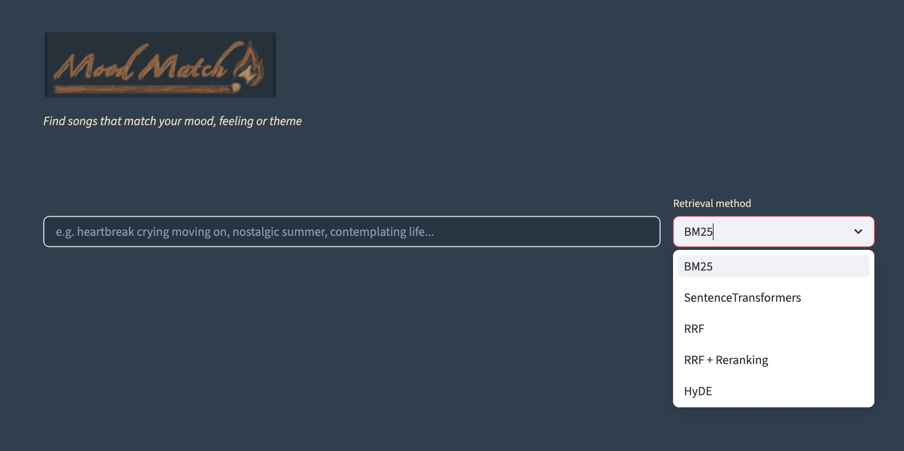

# MoodMatch — Mood-Based Song Retrieval System

MoodMatch is an Information Retrieval system that finds songs by **mood, feeling, or theme** rather than title or artist. Built on 1.35M pop lyrics from the [genius-lyrics-cleaned](https://huggingface.co/datasets/theelderemo/genius-lyrics-cleaned) dataset.


---

## Demo




---

## Features

- **Multi-method retrieval** — BM25, SentenceTransformers + FAISS, RRF hybrid, cross-encoder reranking, HyDE
- **Query expansion** — WordNet synonyms for improved recall
- **Knowledge graph** — RoBERTa emotion labels (26 moods) + GLiNER theme extraction (33 concepts)
- **Mood disambiguation** — "Also feeling?" chips to refine results by mood or theme
- **HyDE** — generates hypothetical lyrics to bridge the query-document semantic gap

---

## Project Structure

```
MoodMatch/
├── app.py                          # Streamlit UI
├── main.py                         # CLI entry point for all 
├── retrieval_modes/
│   ├── preprocessing.py            # Tokenization, stemming, stopword removal
│   ├── BM25_retrieval.py           # BM25 inverted index
│   ├── SentenceTransformer_IR.py   # Dense retrieval + embedding generation
│   ├── faiss_indexing.py           # FAISS index construction
│   ├── rrf_retrieval.py            # Reciprocal Rank Fusion
│   ├── cross_encoder_reranking.py  # Cross-encoder reranking
│   ├── query_expansion.py          # WordNet query expansion
│   ├── hyde.py                     # Hypothetical Document Embeddings
│   ├── knowledge_graph.py          # KG construction + emotion classification
│   ├── gliner_themes.py            # GLiNER theme extraction
│   └── indexing_metadata.py        # SQLite metadata DB
├── evaluation/
│   ├── queries_personal.json       # Personal eval set (10 queries)
│   ├── queries_personal_graded.json # Graded relevance judgments
│   ├── evaluate.py                 # Recall@k + nDCG@k evaluation
│   └── judge_eval.py               # Manual relevance judging script
├── assets/
│   └── MoodMatch.png               # Logo
└── processed/                      # Cached indices (not in git — see below)
    ├── bm25_index.pkl
    ├── st_corpus.pkl
    ├── st_embeddings.npy
    ├── faiss_index.bin
    ├── knowledge_graph.pkl
    └── metadata.db
```

---

## Setup

### Requirements

```bash
uv sync
```

Or with pip:

```bash
pip install -r requirements.txt
```

### Data

The full corpus (1.35M songs) and processed indices are too large for git. To reproduce:

1. Download the dataset from HuggingFace:
   ```python
    from datasets import load_dataset
    ds = load_dataset("theelderemo/genius-lyrics-cleaned")
   ```

2. Build the indices (run on GPU server for full corpus):
   ```bash
# Run individual components
    uv run python main.py bm25      # build BM25 index
    uv run python main.py st        # build ST embeddings
    uv run python main.py faiss     # build FAISS index
    uv run python main.py graph     # build knowledge graph
    uv run python main.py streamlit # run the app
   ```

   > Embedding 1.35M songs takes several hours on GPU. 

### WordNet data (for query expansion)

```python
import nltk
nltk.download('wordnet')
nltk.download('omw-1.4')
```

If the server has no internet access, download locally and copy:
```bash
scp ~/nltk_data/corpora/wordnet.zip user@server:~/nltk_data/corpora/
```

---

## Running the App

```bash
uv run streamlit run app.py
```

First load takes ~10-15 minutes on the full corpus (loading 3GB BM25 index + ST embeddings into RAM). Subsequent queries are fast thanks to `@st.cache_resource`.

For the demo, start the app in advance and leave it running:
```bash
tmux new -s moodmatch
uv run streamlit run app.py
# Ctrl+B D to detach
```

---

## Retrieval Methods

| Method | Description | Best for |
|--------|-------------|----------|
| BM25 | Sparse keyword search with query expansion | Literal queries, named entities |
| SentenceTransformers | Dense semantic search via FAISS | Abstract mood queries |
| RRF | Hybrid fusion of BM25 + ST | General use |
| RRF + Reranking | RRF candidates reranked by cross-encoder | Best precision |
| HyDE | Generates hypothetical lyrics, encodes them | Slang, vibe queries |
| Auto | Rule-based router selects best method | Default |

---

## Evaluation

Evaluated on a personal relevance judgment set (10 queries, graded 0/1/2).

| Method | Recall@100 | nDCG@100 |
|--------|-----------|---------|
| BM25 | 0.000 | 0.000 |
| ST | 0.100 | 0.025 |
| RRF | 0.100 | 0.019 |
| RRF+Rerank | 0.100 | 0.015 |
| HyDE | 0.000 | 0.000 |

Low scores reflect the inherent difficulty of mood-based known-item retrieval over 1.35M songs. ST outperforms BM25, confirming semantic retrieval is better suited to abstract mood queries.

---

## Known Limitations

- Mood relevance is subjective — no objective ground truth exists
- WordNet misinterprets music slang ("bangers" → firecracker)
- Pop corpus bias — 1.35M songs are predominantly English-language pop
- Cover versions and duplicates in corpus affect retrieval and evaluation
- HyDE requires Anthropic API key for live generation (demo mode uses pre-generated hypotheses)

---

## Future Work

- Query expansion via LLM instead of WordNet (handles slang better)
- ColBERT late interaction reranking
- Matryoshka embeddings for faster retrieval at scale
- Multilingual queries
- Spotify integration — album art, audio previews
- Larger crowdsourced golden dataset
- Query router to select best retrieval method for query 

---

## Course Context

Built as part of an Information Retrieval course project. The system implements concepts including inverted indices, dense retrieval, hybrid search, knowledge graphs, named entity recognition, and query expansion.